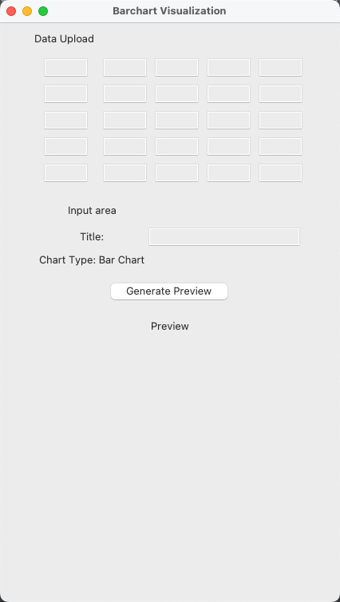

# 条形图可视化工具

## 简介
这是一个简单的条形图可视化工具，使用Python的Tkinter创建GUI，使用Matplotlib生成和显示条形图。该工具允许用户输入标题，以生成条形图的预览。

## 运行环境
- Python 3.x
- 必要库：tkinter、matplotlib

## 功能特点
1. **数据输入:**
   - 用户可以在一个5x5的网格中输入数据点。
   - 数据经过验证以确保是数字，所有字段必须填写。

2. **标题输入:**
   - 用户可以自定义图表标题。

3. **图表预览:**
   - 根据输入的数据生成条形图预览。

## 如何使用
1. 运行脚本。
2. 在提供的网格中输入数字数据点。
3. 指定图表标题。
4. 单击“生成预览”按钮以可视化条形图。

## 代码结构
- 代码采用一个类（`BarchartVisualizationApp`）的结构，将整个应用封装起来。
- 为了清晰起见，数据输入和图表预览被组织到不同的框架中。

## 依赖关系
- 该工具依赖于tkinter库用于GUI和matplotlib库用于创建和显示条形图。

## 示例

## 注意事项
- 在运行脚本之前，请确保安装了所需的库（`tkinter`和`matplotlib`）。
- 图表预览画布的大小被设置为固定大小（400x300），可以根据用户的偏好进行调整。
- 脚本使用5x5的网格进行数据输入。如果需要，可以修改代码以更改网格大小。

